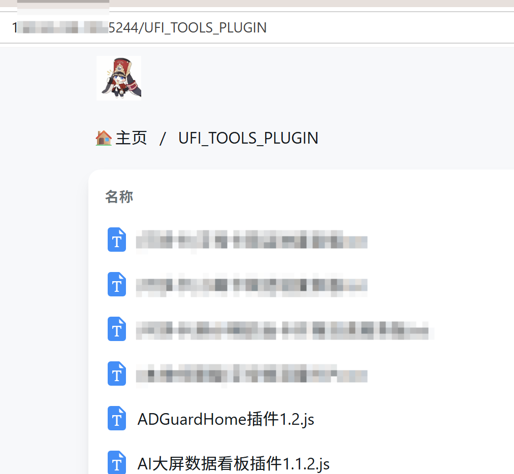
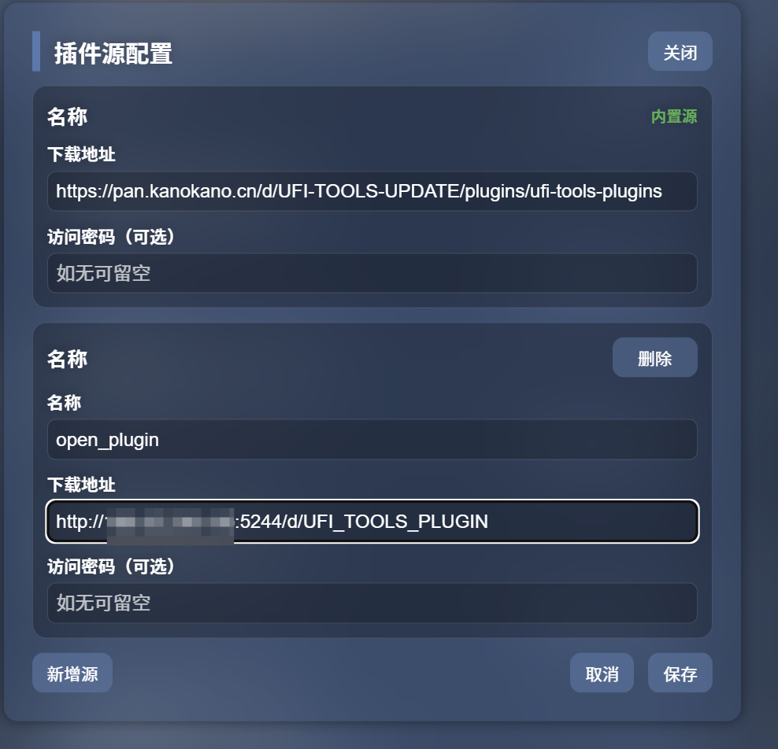

## 简介  
  自用修改版，不会与原始仓库同步  
  

## 特性

- 移除了云端设备限制、信息收集与上报
- 移除了原始开发者面向用户的信息推送、软件OTA等远程代码执行能力
- 支持自定义插件商店，更多私有化插件源以及插件仓库密码配置，使用[openlist](https://github.com/OpenListTeam/OpenList)搭建

## 下载与使用
 请前往[github action](https://github.com/XuF163/UFI-TOOLS/actions)获取最新编译的apk

- 插件商店配置  
  例如，你的自建openlist插件目录为：http://ip:5244/UFI_TOOLS_PLUGIN 
  
  则插件商店应该配置如下：  
  
## 许可证  
本分支修改的部分：GNU Affero General Public License v3.0

## 免责声明
自本分支修改起，请勿进行任何可能涉嫌侵犯他人权益的行为

## 致谢
- [OpenList](https://github.com/OpenListTeam/OpenList)提供绿色、可信赖的存储功能
- [ZTE](https://www.ztedevices.com)设计高性价比的硬件设备
